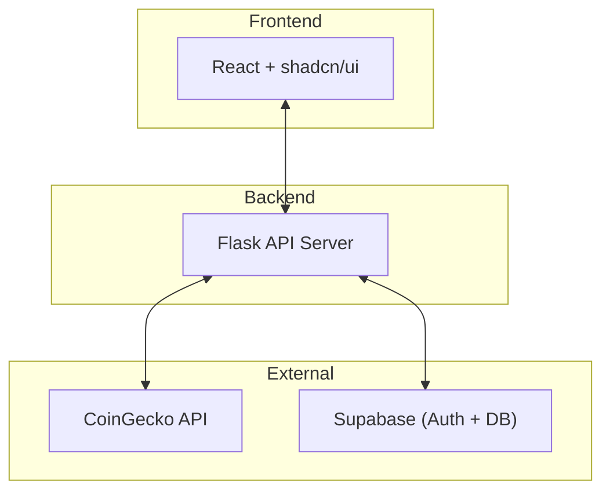

# Design Doc — Crypto App

## Context

This project is primarily for educational purposes. The goal is to give beginners hands-on experience building an end-to-end fullstack application using a modern stack: Flask for the backend, React + shadcn/ui for the frontend, Supabase for authentication and persistence, and Docker + Railway for deployment.

To make the learning process concrete, we’re building a simple Crypto Tracker app. Cryptocurrency prices change constantly, and many users want a quick way to track markets and save their favorite coins. Instead of hitting the CoinGecko API directly from the frontend, we’ll build our own lightweight wrapper API server. This approach gives us more control, reduces request overhead, and provides a clean interface between the frontend, backend, and database.

## Goals

* ✅ Allow users to **sign up / log in**
* ✅ Display **live crypto prices** (via our wrapper server)
* ✅ Let users **favorite coins** and store them in our database
* ✅ Keep the system lightweight and beginner-friendly (teachable in 5 weeks)
* ✅ Provide a clear deployment path (local dev → Docker → Railway)

## Non-Goals

* ❌ No trading or exchange integration
* ❌ No blockchain interaction
* ❌ No advanced analytics or portfolio management
* ❌ No payment processing

## Architecture

**High-Level Flow:**

* **Frontend (React + shadcn/ui)** — renders UI, calls our wrapper API
* **Wrapper API Server (Flask)** — fetches from CoinGecko, shapes responses, interacts with Supabase for persistence
* **External APIs**: CoinGecko for live market data
* **Database (Supabase)**: user accounts + favorites
* **Deployment**: Docker (dev), Railway (prod)

### Diagram

## Components

### Frontend

* Built with React + shadcn/ui
* Pages:

  * Landing page
  * Login / Signup
  * All cryptos list (table with search & sort)
  * Favorites page

### Backend (Flask API)

* Endpoints:

  * `GET /api/health` → health check
  * `GET /api/coins` → list coins (with filters, sort, limit)
  * `GET /api/coins/:id` → single coin detail
  * `POST /api/favorites` → add favorite
  * `GET /api/favorites` → list favorites for current user
  * `DELETE /api/favorites/:id` → remove favorite

### Database (Supabase)

* **users** (managed by Supabase Auth)
* **favorites**:

  * `id` (pk)
  * `user_id` (fk → users.id)
  * `coin_id` (string, e.g. "bitcoin")
  * `created_at` (timestamp)
