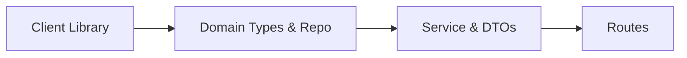

# Week 2 Lab - Flask Wrapper API

## Goal

Implement a small Flask API that wraps CoinGecko using the layered pattern from the walkthrough:



You’ll build **coins** endpoints. Use the **Pokémon walkthrough** only as a structural reference (do not copy code).

---

## What you’ll build

Expose exactly **three** endpoints:

1. `GET /coins` → returns a list of **Coin DTOs** for all fetched coins  
    **DTO shape (per item):**
    

```json
{ "id": "...", "symbol": "...", "name": "...", "image_url": "...", "current_price": 0, "market_cap": 0 }
```

2. `GET /coins/<id>` → returns a **Coin domain object** for a single coin  
    **Domain shape (minimum):**
    

```json
{
  "id": "...",
  "symbol": "...",
  "name": "...",
  "image_url": "...",
  "current_price": 0,
  "market_cap": 0,
  "market_cap_rank": 0,
  "total_volume": 0,
  "high_24h": 0,
  "low_24h": 0,
  "price_change_24h": 0,
  "price_change_percentage_24h": 0,
  "circulating_supply": 0
}
```

3. `GET /coins/search?q=...` → returns a list of **Coin DTOs** whose **name is prefixed** by the query (case-insensitive)  
    **DTO shape (per item):**
    

```json
{ "id": "...", "symbol": "...", "name": "...", "image_url": "...", "current_price": 0, "market_cap": 0 }
```

**Route principles** (Flask): routes are thin → parse inputs → call service → return JSON.  
All mapping and “what we expose” decisions belong in the **service + DTOs** layer.

---

## Initial setup

### 1) Create the project folder

```bash
mkdir api
```

### 2) Set up your virtual environment (choose your shell)

```bash
cd api
python3 -m venv venv
source venv/bin/activate
python -m pip install --upgrade pip
pip install flask requests pytest python-dotenv
```

```powershell
cd api
py -3 -m venv venv
.\venv\Scripts\Activate.ps1
python -m pip install --upgrade pip
pip install flask requests pytest python-dotenv
```

```bat
cd api
py -3 -m venv venv
venv\Scripts\activate.bat
python -m pip install --upgrade pip
pip install flask requests pytest python-dotenv
```

> Deactivate with `deactivate`.

### 3) Create the project layout

```
client/
  __init__.py
  coingecko.py        # CoinGeckoClient (HTTP only)
domain/
  __init__.py
  coin.py             # Coin (domain type)
dtos/
  __init__.py
  coin.py             # CoinDTO (public contract)
repo/
  __init__.py
  coin_repo.py        # CoinRepo (singleton; read/write/read_all)
service/
  __init__.py
  coin_service.py     # CoinService (mapping + preload)
app.py                # Flask routes
tests/
  test_coins.py       # Acceptance tests (provided)
```

**Helpful commands (macOS/Linux):**

```bash
mkdir -p client domain dtos repo service tests
touch client/__init__.py client/coingecko.py
touch domain/__init__.py domain/coin.py
touch dtos/__init__.py dtos/coin.py
touch repo/__init__.py repo/coin_repo.py
touch service/__init__.py service/coin_service.py
touch app.py tests/test_coins.py
```

### 4) Environment variables

Create `.env` in `api/`:

```ini
API_KEY=your-demo-key-here
BASE_URL=https://api.coingecko.com/api/v3/coins/markets
```

---

## Requirements (by layer)

### Client Library — `client/coingecko.py`

- **Responsibility:** external HTTP calls **only** (no mapping / no DTOs).
    
- Must send the CoinGecko demo header:  
    `x-cg-demo-api-key: <API_KEY>`
    
- Must call `GET https://api.coingecko.com/api/v3/coins/markets` with params:
    
    - `vs_currency=usd`
        
    - `order=market_cap_desc`
        
    - `per_page=100`
        
    - `page=1`
        
    - `sparkline=false`
        
- Return **raw JSON** (list of dicts).
    
- Use `raise_for_status()` (or rethrow as your own `ClientError`).
    
- Keep it **mockable** (single class, method like `fetch(...)`).
    

> **Reference from walkthrough (Pokémon):** Your `PokeClient` wrapped HTTP and returned raw provider data. Do the same here but include the CoinGecko API key header (`x-cg-demo-api-key` for Demo, or `x-cg-pro-api-key` for Pro) and the correct base URL. See **Ping** docs for header usage: https://docs.coingecko.com/v3.0.1/reference/ping-server

---

### Domain Types — `domain/coin.py`

- Create a `Coin` dataclass with at least the **Domain shape** fields listed in _What you’ll build_.
    
- This is your **internal representation** (not exposed directly).
    

---

### Repo — `repo/coin_repo.py`

- Implement a **singleton** `CoinRepo` with exactly this interface:
    
    - `write(coin: Coin) -> None`
        
    - `read(coin_id: str) -> Coin | None`
        
    - `read_all() -> list[Coin]`
        
- Store coins **by id** in memory.
    

---

### DTOs — `dtos/coin.py`

- Create a `CoinDTO` class (or dataclass) exposing:
    
    - `id, symbol, name, image_url, current_price, market_cap`
        
- Add a simple `to_dict()` if you prefer explicit serialization (or rely on `.__dict__`).
    

---

### Service — `service/coin_service.py`

- `CoinService` composes **client + repo** and contains **mapping** code.
    
- **Methods (required):**
    
    - `preload()` → fetch **≥50** coins via client, map to `Coin`, store in repo
        
    - `get(coin_id: str) -> Coin | None` → **domain** object
        
    - `get_all() -> list[CoinDTO]` → brief list
        
    - `search(q: str) -> list[CoinDTO]` → **prefix** match on `name` (case-insensitive)
        
- **Mapping rules:**
    
    - Raw JSON → `Coin` happens **here** (not in client/routes)
        
    - `Coin` → `CoinDTO` happens **here** (not in routes)
        

> **Reference from walkthrough (Pokémon):** `PokemonService` did cache-miss fetch, mapping raw→domain and domain→DTO. Mirror that pattern.

---

### Routes (Flask) — `app.py`

- Create `app = Flask(__name__)`.
    
- Instantiate `CoinService` with `CoinGeckoClient` and call `service.preload()` at startup.
    
- Define routes (thin):
    
    - `GET /coins` → `service.get_all()` → return **DTO[]**
        
    - `GET /coins/<id>` → `service.get(id)` → return **domain** or `404`
        
    - `GET /coins/search?q=...` → validate `q` (non-empty) → `service.search(q)` → **DTO[]**
        

---

## Acceptance tests (provided)

Create `tests/test_coins.py` with the following content:

```python
import pytest
from app import app

@pytest.fixture
def client():
    app.testing = True
    with app.test_client() as c:
        yield c

def test_list_all_returns_array_of_dtos(client):
    r = client.get("/coins")
    assert r.status_code == 200
    data = r.get_json()
    assert isinstance(data, list)
    if data:  # tolerate empty in edge cases
        sample = data[0]
        assert {"id","symbol","name","image_url","current_price","market_cap"}.issubset(sample.keys())

def test_search_requires_q(client):
    r = client.get("/coins/search")
    assert r.status_code == 400
    assert "error" in r.get_json()

def test_search_returns_dtos(client):
    r = client.get("/coins/search?q=bit")
    assert r.status_code == 200
    data = r.get_json()
    assert isinstance(data, list)
    if data:
        sample = data[0]
        assert {"id","symbol","name","image_url","current_price","market_cap"}.issubset(sample.keys())

def test_detail_returns_domain_or_404(client):
    # OK if not preloaded: may be 404.
    # If you preload popular coins, /coins/bitcoin will likely be 200.
    r = client.get("/coins/bitcoin")
    assert r.status_code in (200, 404)
    if r.status_code == 200:
        obj = r.get_json()
        expected = {
            "id","symbol","name","image_url","current_price","market_cap",
            "market_cap_rank","total_volume","high_24h","low_24h",
            "price_change_24h","price_change_percentage_24h","circulating_supply"
        }
        assert expected.issubset(set(obj.keys()))
```

> If you want **no network in tests**, add an env flag (e.g., `SKIP_PRELOAD=1`) and conditionally skip `service.preload()`, or **monkeypatch** your client in `app.py` to return a small static payload.

---

## Running the app & tests

```bash
# run the server (from api/)
flask --app app run --reload

# run tests
pytest -q
```

---

## Optional practice — Pokémon

Recreate the same pattern with **Pokémon**:

- `GET /pokemon` (DTO[]), `GET /pokemon/<id>` (domain), `GET /pokemon/search?q=` (DTO[])
    
- Keep the **same layers**, **same repo interface**, **same route thinness**.
    
- Use the walkthrough as an **example**, not a source of copy-paste.
    

---

## Rubric (what I’ll check)

- **Client Library** sends header `x-cg-demo-api-key` and calls CoinGecko markets with correct params.
    
- **Domain & DTOs** match required shapes.
    
- **Repo** is a singleton with `read / write / read_all`.
    
- **Service** maps raw→domain and domain→DTO, and implements `preload / get / get_all / search`.
    
- **Routes** are thin and return the correct shapes.
    
- **Tests** pass locally.
    
